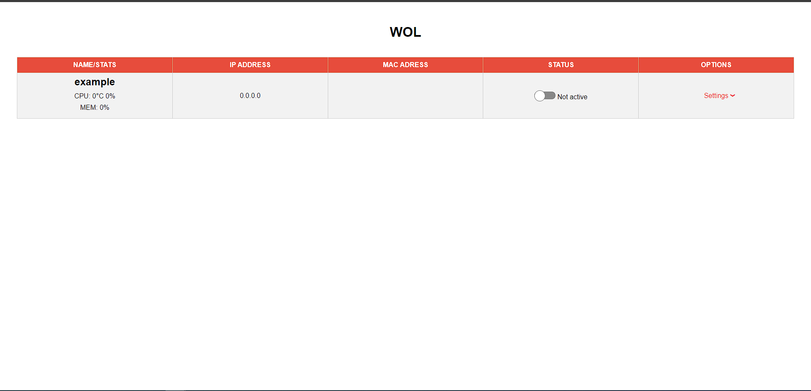
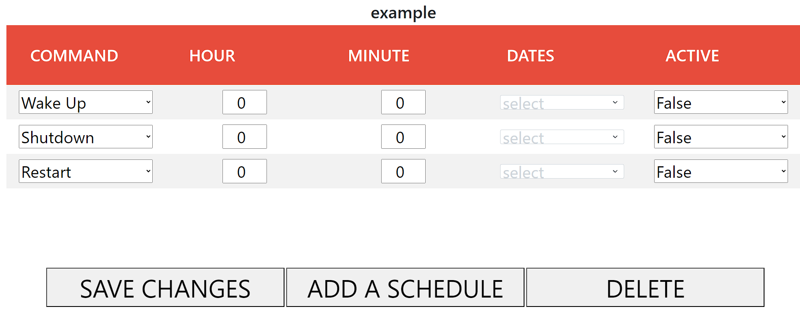

# WOL WEB INTERFACE

This is a docker container used to control your lan devices. The service runs on port 3000 and if you wanna change it look at the documentation/wiki.


## Screenshots





## Features

- Shutdown devices (only if you installed WOL WEB API on that device)
- Restart devices (only if you installed WOL WEB API on that device)
- Get stats from your device (only if you installed WOL WEB API on that device)
- WAKE ON LAN (needs wake on lan enabled on that device)

## Installation

Install wol web interface using docker compose:

```bash
  git clone https://github.com/cosmin1805/WOL-WEB-INTERFACE.git
  cd WOL-WEB-INTERFACE
  docker compose up -d --build
```
    
## Documentation

[Documentation](https://linktodocumentation)


## Feedback

If you have any feedback, please reach out to me at cosmin1805.github@gmail.com


## License

[ISC](https://choosealicense.com/licenses/isc/)

